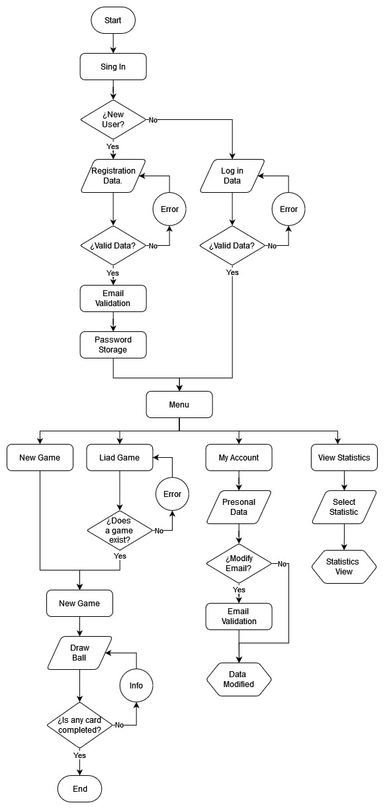
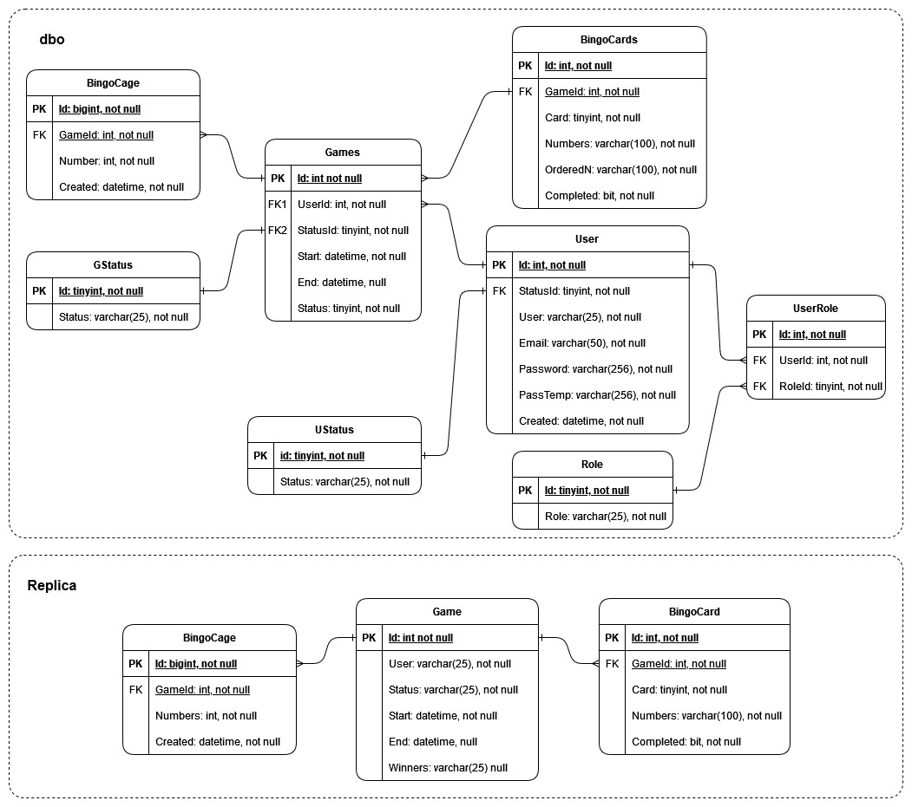
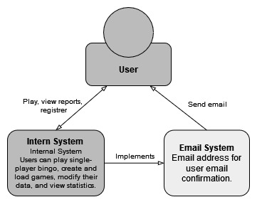

<section align="center">

# Bingo

[Documentation](https://github.com/MatiasMolina000/Juegobingo/tree/main)
·
[Report Bug](https://github.com/MatiasMolina000/Juegobingo/issues)
·
[Request Feature](https://github.com/MatiasMolina000/Juegobingo/issues)

</section>

  

## 💼 About the proyecto
Final project of the **Introducción .NET 6** course at *"Polo Tecnológico de Mina Clavero"*, customized with the purpose of merging the concepts learned and achieving a comprehensive solution.

  

## 📝 Requirements
For this proyect, the focus is on three aspects:
 - Game dynamics.
 - Bingo cards construction.
 - Storable information.

#### 🔎 [View more: Requirements.md](./docs/Requirements.md)

  

## 📖 Proposal
The objective of this project is to achieve a practical application by applying some technical development and management and documentation knowledge.

For more details regarding the project definition, you can access the following link.
#### 🔎 [View more: Proyect.md](./docs/Proyect.md)

  

## 📈 Planning
The following link will redirect you to the repository's list of issues:

#### 🎫 [View more: Issues](https://github.com/users/MatiasMolina000/projects/1/views/2?layout=roadmap)

  

## ✏️ Design

 

### 👥 Roles

<table align=center>
    <thead>
        <tr>
            <th>Positions</th>
            <th>Roles</th>
        </tr>
    </thead>
    <tbody>
        <tr>
            <td>Administrator: user with acces to general metrics.</td>
            <td>Admin</td>
        </tr>
        <tr>
            <td>Client: user for whom the application is intended.</td>
            <td>Player</td>
        </tr>
    </tbody>
</table>

 

### ⬇️ Whorkflow
To explain and understand the process and translate it inot the user's experience, it is represented through the following User Flow Diagram.

<section align=center>
    
</section>

 

### 👤 Use Cases

<section align=center>
    
</section>

#### 🔎 [View more. General process definition](./docs/redesign/General_process_definition.md)

 

### 🔖 Entity-Relationship diagram

<section align=center>
    
</section>

 

You can see the analysis that precedes the design of the diagram at the following link: 
- 🔬 [**Analysis**](./docs/redesign/Database_model_review.md)

#### 📋 [View more: Data_Dictionary.md](./docs/redesign/Data_Dictionary.md)

 

### 👓 Interfaces

The purpose of the following document is to catalog and present the various interfaces that will compose the solution and will serve as a reference for the development of views and models for communication.

<!--
#### 📋 [Interface_Description.md]()
-->

  

## 💻 Solution

### 📐 Architecture

#### General System Structure

<section align=center>
    
</section>

#### General Solition Structure

#### 👾 Stack

- 🌸 [Front End]()
- 💀 [Back End]()
- 🏦 [Store]()

## 🚀 Deploy

...