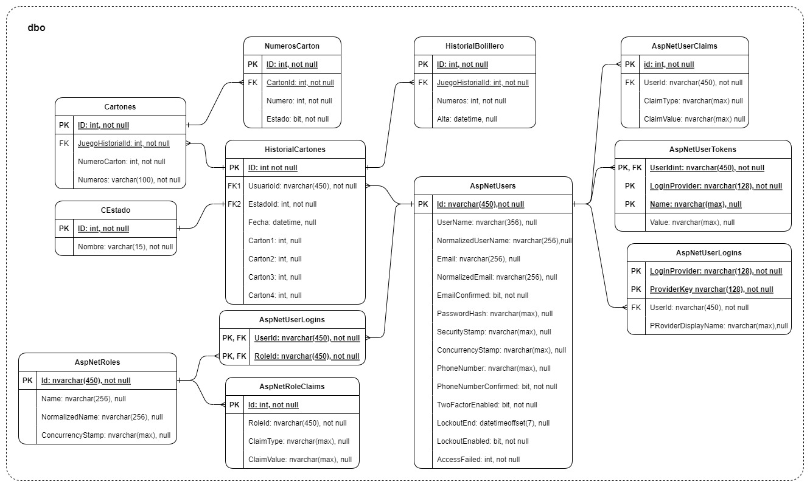

### 🔍 Database Model Review.

This document aims to present the analysis of the current model in relation to the objectives set forth in the README.md of the main branch of the repository.

 

### 📜 Current Entity-Relationship Diagram. 

<section align=center>

</section>

 

### 📋 Analysis
<table>
    <thead>
        <tr>
            <th>Item</th>
            <th>Observation</th>
            <th>Proposed Solution</th>
        </tr>
    </thead>
    <tbody>
        <tr>
            <td>Game Dynamics</td>
            <td>The requested storage model is not being followed.</td>
            <td>Replace in the <strong>dbo</strong> schema entities: - "CardRecord" with "Game" - "BallRecord" with "BingoCage"
            </td>
        </tr>
        <tr>
            <td>Construction of Bingo Cards</td>
            <td>Possible duplicate cards.</td>
            <td>Include the "Numbers" attribute in the "BingoCards" entity to control repetition in the cards of the same game.</td>
        </tr>
        <tr>
            <td>Storable Information</td>
            <td>The requested storage model is not being followed.</td>
            <td>Requested tables "BallRecord" and "CardRecord". : - New schema, <strong>Replica</strong>, where they are included. - ETL process/Scheduled Task for populating them from the <strong>dbo</strong> model.</td>
        </tr>
        <tr>
            <td>Report: "My Played Games"</td>
            <td>Data could be pre-processed in another schema.</td>
            <td>- New schema, <strong>Replica</strong>. - ETL for filling the "Game" table.</td>
        </tr>
        <tr>
            <td>Report: "General Games"</td>
            <td>Data could be pre-processed in another schema.</td>
            <td>Requested tables "Game", "BingoCard" and "BingoCage": - New schema, <strong>Replica</strong>, where they are included. - ETL process/Scheduled Task for populating them from the <strong>dbo</strong> model.</td>
        </tr>
        <tr>
            <td>Report: "Successful History (winning numbers and probability)"</td>
            <td>Data could be pre-processed in another schema.</td>
            <td>- New schema, <strong>Replica</strong>. - ETL process/Scheduled Task for filling the "BingoCage" table.</td>
        </tr>
        <tr>
            <td>Dashboard: "Total Players"</td>
            <td>Data could be pre-processed in another schema.</td>
            <td>- New schema, <strong>Replica</strong>. - ETL process/Scheduled Task for filling the "Game" table.</td>
        </tr>
        <tr>
            <td>Dashboard: "Total Numbers Played"</td>
            <td>Data could be pre-processed in another schema.</td>
            <td>- New schema, <strong>Replica</strong>. - ETL process/Scheduled Task for filling the "Game" table. - New schema, <strong>Replica</strong>, where the requested table "BingoCage" are included. - ETL process/Scheduled Task for populating them from the <strong>dbo</strong> model.</td>
        </tr>
        <tr>
            <td>Dashboard: "Total Games Played"</td>
            <td>Data could be pre-processed in another schema.</td>
            <td>- New schema, <strong>Replica</strong>. - ETL process/Scheduled Task for filling the "Game" table. - New schema, <strong>Replica</strong>, where the requested table "BingoCards" are included. - ETL process/Scheduled Task for populating them from the <strong>dbo</strong> model.</td>
        </tr>
        <tr>
            <td>Dashboard: "Most Played Numbers"</td>
            <td>Data could be pre-processed in another schema.</td>
            <td>- New schema, <strong>Replica</strong>. - ETL process/Scheduled Task for filling the "Game" table. - New schema, <strong>Replica</strong>, where the requested table "BingoCage" are included. - ETL process/Scheduled Task for populating them from the <strong>dbo</strong> model.</td>
        </tr>
        <tr>
            <td>Dashboard: "Numbers with the Most Success"</td>
            <td>Data could be pre-processed in another schema.</td>
            <td>- New schema, <strong>Replica</strong>. - ETL process/Scheduled Task for filling the "Game" and "BingoCage" tables.</td>
        </tr>
        <tr>
            <td>Dashboard: "Successful History (winning numbers and probability)"</td>
            <td>Data could be pre-processed in another schema.</td>
            <td>- New schema, <strong>Replica</strong>. - ETL process/Scheduled Task for filling the "Game" and "BingoCage" tables.</td>
        </tr>
        <tr>
            <td>User Roles Schema</td>
            <td>Only the role name is being used.</td>
            <td>Eliminate: - The "AspNetRoleClaims" entity. - The "NormalizedNames" and "ConcurrencyStamp" attributes from the "AspNetRoles" entity.</td>
        </tr>
        <tr>
            <td>Login and Registration</td>
            <td>Only Id, Name, Email, Password, and Registration Date are implemented.</td>
            <td>Replace the "AspNetUser" entity with "User" and include attributes related to the implemented ones.</td>
        </tr>
        <tr>
            <td>Email Validation</td>
            <td>Only Id, Name, Email, Password, and Registration Date are implemented.</td>
            <td>Replace the "AspNetUser" entity with "User" and include attributes related to the implemented ones.</td>
        </tr>
        <tr>
            <td>Password Reset</td>
            <td>Only Id, Name, Email, Password, and Registration Date are implemented.</td>
            <td>Replace the "AspNetUser" entity with "User" and include attributes related to the implemented ones.</td>
        </tr>
    </tbody>
</table>

  

<footer align="center">
    

### ◀️ [Return](../../README.md)

</footer>