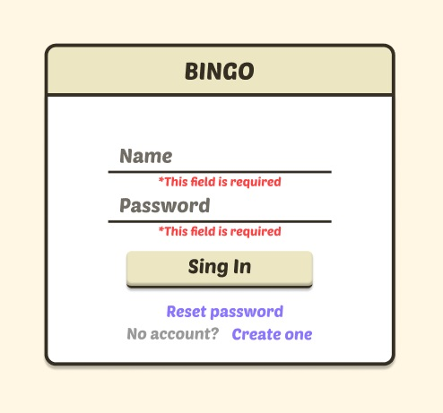
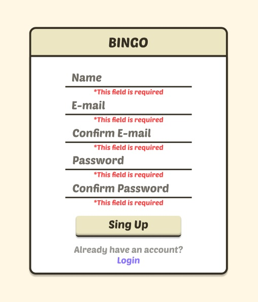
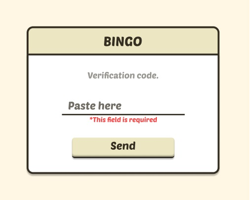
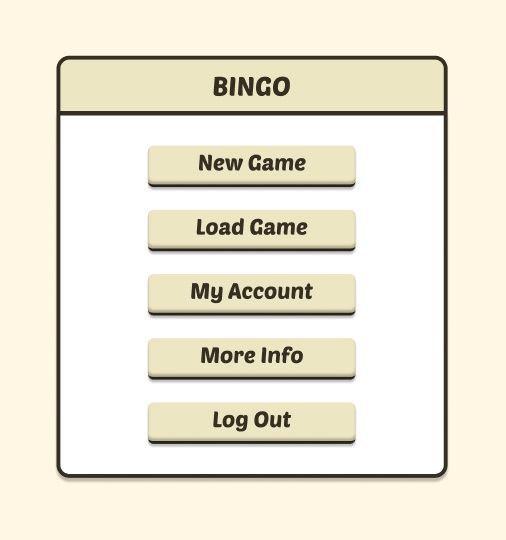
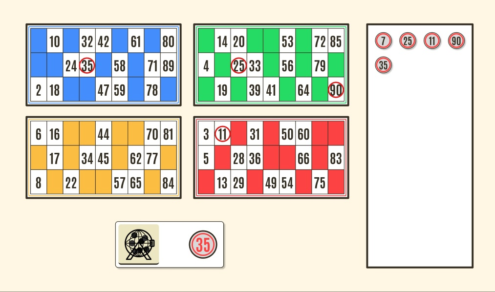
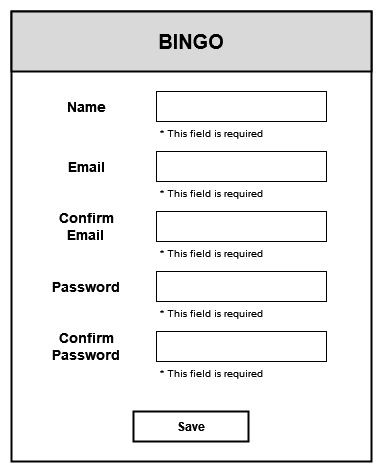
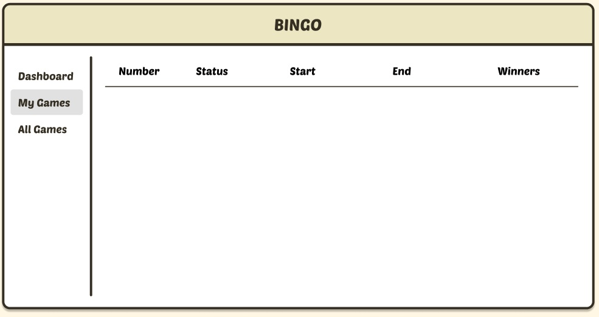

### 👓 Interfaces

This document aims to present the various interfaces that will compose the solution and will serve as a reference for the development of views and models for communication.

 

<section align=center>
<h3>Glosary</h3>    

<article align=left id="#sc-1">

- <u>**Id:**</u> SC-1

- <u>**View:**</u> 

<a href="">Low-Fidelity</a>

- <u>**Description:**</u> View for user authentication and access to the web application. 

- <u>**Data:**</u>

| Field | Entity | Name | Type of field | Length | Allows Null | Deffautlt value | 
|:-----:|:------:|:----:|:-------------:|:------:|:-----------:|:---------------:|
| Name | User | User | string | 25 bytes | No | N/A |
| Password | User | Password | string | 64 bytes | No | N/A |

</article>

 
 

<article align=left id="#sc-2">

- <u>**Id:**</u> SC-2

- <u>**View:**</u> 

<a href="">Low-Fidelity</a>

- <u>**Description:**</u> View for user registration in the database. 

- <u>**Data:**</u>

| Field | Entity | Name | Type of field | Length | Allows Null | Deffautlt value | 
|:-----:|:------:|:----:|:-------------:|:------:|:-----------:|:---------------:|
| Name | User | User | string | 25 bytes | No | N/A |
| Email | User | Email | varchar | 50 bytes | No | N/A |
| Password | User | Pas | string | 64 bytes | No | N/A |

</article>

 
 

<article align=left id="#sc-3">

- <u>**Id:**</u> SC-3

- <u>**View:**</u> 

<a href="">Low-Fidelity</a>

- <u>**Description:**</u> View for usert to confirm their e-mail after a password lock or sing up.

- <u>**Data:**</u>

| Field | Entity | Name | Type of field | Length | Allows Null | Deffautlt value | 
|:-----:|:------:|:----:|:-------------:|:------:|:-----------:|:---------------:|
| Id | User | Id | int | 4 bytes | No | N/A |
| Verification code | PasswordTemp | User | string | 64 bytes | No | N/A |

</article>

 
 

<article align=left id="#sc-4">

- <u>**Id:**</u> SC-4

- <u>**View:**</u> 

<a href="">Low-Fidelity</a>

- <u>**Description:**</u> View of main menu after user  autentication. 

- <u>**Data:**</u>

| Field | Entity | Name | Type of field | Length | Allows Null | Deffautlt value | 
|:-----:|:------:|:----:|:-------------:|:------:|:-----------:|:---------------:|
| Id | User | Id | string | 25 bytes | No | N/A |
| Status | UStatus | Id | tinyint | 1 bytes | No | N/A |
| Id | BingoCage | Id | tinyint | 1 bytes | No | N/A |

</article>

 
 

<article align=left id="#sc-5">

- <u>**Id:**</u> SC-5

- <u>**View:**</u> 

<a href="">Low-Fidelity</a>

- <u>**Description:**</u> View of the bingo game. 

- <u>**Data:**</u>

| Field | Entity | Name | Type of field | Length | Allows Null | Deffautlt value | 
|:-----:|:------:|:----:|:-------------:|:------:|:-----------:|:---------------:|
| Id | User | Id | string | 25 bytes | No | N/A |
| Status | UStatus | Id | tinyint | 1 bytes | No | N/A |
| Id | Games | Id | int | 1 bytes | No | N/A |
| Status | Games | StatusId | tinyint | 1 bytes | No | N/A |
| Numbers | BingoCage | Number | int | 4 bytes | No | N/A |
| Id | BingoCard | Id | bigint | 8 bytes | No | N/A |
| Card | BingoCard | Card | tinyint | 1 bytes | No | N/A |
| Numbers | BingoCard | Numbers | varchar | 100 bytes | No | N/A |
| OrderedN | BingoCard | OrderedN | varchar | 100 bytes | No | N/A |
| Completed | BingoCard | Completed | bit | 1 bytes | No | N/A |

</article>

 
 

<article align=left id="#sc-6">

- <u>**Id:**</u> SC-6

- <u>**View:**</u> 

<a href="">Low-Fidelity</a>

- <u>**Description:**</u> View for the user modifies their user data. 

- <u>**Data:**</u>

| Field | Entity | Name | Type of field | Length | Allows Null | Deffautlt value | 
|:-----:|:------:|:----:|:-------------:|:------:|:-----------:|:---------------:|
| Name | User | User | string | 25 bytes | No | N/A |
| Email | User | Email | varchar | 50 bytes | No | N/A |
| Password | User | Pas | string | 64 bytes | No | N/A |

</article>

 
 

<article align=left id="#sc-7">

- <u>**Id:**</u> SC-7

- <u>**View:**</u> 

<a href="">Low-Fidelity</a>

- <u>**Description:**</u> View for displays the requested information. 

- <u>**Data:**</u>

This data is explained in [Reporting](./Reporting/) section.

</article>

</section>

  

<footer align="center">
    

### ◀️ [Return](../../README.md)

</footer>